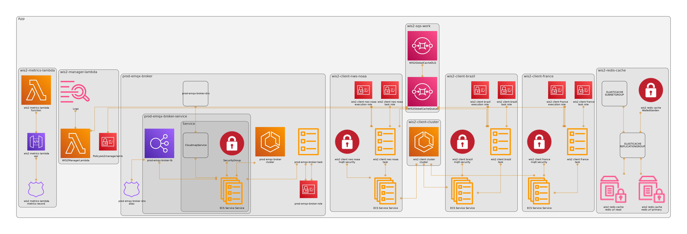

# WIS2.0 Global Cache

## 1. Introduction
This repository contains the WIS2.0 Global Cache service, a caching solution composed of multiple components. The service is deployed using AWS CDK, ensuring a scalable and efficient caching infrastructure.



## 2. Components

### 2.1. MQTT Client Service (paho MQTT - Fargate)
Uses a Fargate cluster to deploy one mqtt listenner client per global broker. Global Broker connection strings are stored in Secrets Manager. The client listens for incoming messages on the appropriate topics using paho MQTT and then queues the messages on SQS.  
`Stack File: deploy/stacks/wis2_client_stack.py`

### 2.2. Queue (SQS)
Deploys an SQS queue to handle message queuing. It ensures reliable message delivery and processing. The queue service includes a dead-letter queue for failed messages and a queue policy for access control.  
`Stack File: deploy/stacks/wis2_queue_stack.py`

### 2.3. Lambda Manager (python Lambda)
The Manager Lambda is responsible for processing messages from the queue. It reads messages from the queue, processes them, stores them in the cache, and publishes the cache messages if successful. 

### 2.4. Metrics and duplicate detection (redis elasticache)
The cache is implemented using redis Elasticache replication enabled cluster. The cache is used to store message data_ids, and their datetimes and to detect duplicate WIS2 notification messages. The cache is also used to store metrics data, such as the number of messages processed, the number of failures, and the datetime of the last successfully downloaded message that are returned by the metrics lambda.

### 2.5. MQTT Broker (EMQX - Fargate)
The local MQTT broker for the GC service. The broker is used to publish cache messages to subscribed clients (other WIS2 global services). An admin dashboard is also available to monitor the broker.

### 2.6. Metrics Lambda (python Lambda)
The Metrics Lambda is responsible for returning metrics data from the redis cache. It reads metrics data from the cache and returns the data to the client. This is coordinated by the API Gateway.

## 3. Deployment
This service is deployed using AWS CDK. The deployment is done in two steps, first deploying the infrastructure and then deploying the services.

### 3.1. Prerequisites

#### 3.1.1. Foundational Components
A number of foundational components are required to deploy the WIS2.0 Global Cache service that are not managed by this repository/CDK. These include:
* An AWS account
* An AWS VPC
* Domain Name System (DNS) configuration 
  * A Route 53 hosted zone
  * A registered domain name
  * A cert for ssl/tls with associated records in the hosted zone
* NAT Gateways (2) for static IP addresses
* An S3 bucket where the assets are stored
  * this is currently managed by the UKMet office and provided by ASDI
* the necessary role to which the necessary permissions are attached. Currently, the `WIS2ManagerLambdaRole` referenced in the wis2_lambda_stack.py.

#### 3.1.2. AWS CDK (Cloud Development Kit)

Follow the [AWS CDK Guide](https://docs.aws.amazon.com/cdk/v2/guide/home.html) for prerequisites and installation
instructions.

### 3.2. Deployment Steps

The best way to log in to the AWS account is to use the AWS CLI. The following command will open a browser window and
ask you to log in to the AWS account.

```bash
aws configure sso
```

or if you already have your profile set up, you can use the following command:

```bash
aws sso login --profile <profile_name>
```

Then you can deploy the stack using the _deploy_ command, ie:

```bash
cdk deploy --all --profile wis2-gc
```

#### 3.2.1. Development deployment

Under the _deploy_ directory there is a corresponding app_dev.py file that can be used to deploy a similar app, to the
development environment. Environment variables and parameters are set in this file and passed to the same stack components used in the
prod app.py file.

```bash
cdk deploy --all --profile wis2-gc --app "python app_dev.py"
```

